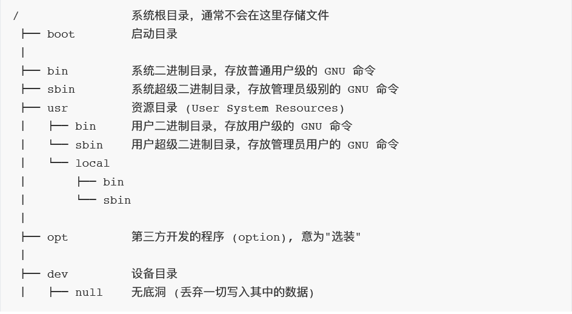
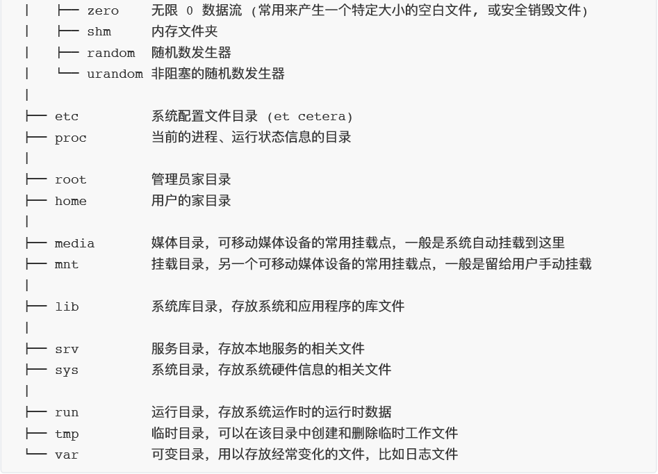

# 基本的Shell命令

## Sheel简介

* kernel(内核)
   是操作系统的核心,**直接与硬件打交道**,处理很多底层的事情。一般禁止普通用户直接操作,外部程序想要调用内核功能需要使用 **“系统调用” 的接口**。

* **Shell 是一个应用程序**,它连接了用户和 Linux 内核,让用户能够更加高效、安全、低成本地使用Linux 内核,这就是 Shell 的本质。

* Shell 一般分为 “**用户界面 (GUI)**” 和 “**命令行 (CLI)**” 两种
  
  * 常见的 GUI Shell
  * Gnome
  
    * KDE
    * Xface
  
  * 常见的 CLI Shell
    * sh: Bourne shell, 史蒂夫·伯恩在贝尔实验室时编写。1978年随
    
      Version 7 Unix首次发布。
    * csh: C shell, 比比尔·乔伊在加州大学伯克利利分校时编写。1979年随BSD首次发布。
    * bash: Bourne-Again shell, 1987年由布莱恩·福克斯为了了GNU计划而编写。原先是计划用在GNU操作系统上,但能运行于大多数类Unix系统的操作系统之上,包括Linux 与 MacOS 都将它作为默认shell。是应用最广的 Shell。
    * zsh: Z shell, 名称的含义是 “The last shell you’ll ever need!”,Zsh 对 Bourne shell做出了了大量改进,同时加入了其他shell的某些功能,强化了自动补全功能,还加入了插件机制,定制性非常高,功能最为强大。
  * 可以通过 `cat /etc/shells` 查看当前系统安装了哪些 Shell

## Bash终端快捷键

```tex
ctl + f  向右前进一个字符
ctl + b  向左后退一个字符

ctl + a  回到行首
ctl + e  会到行尾

ctl + w  向左删除一个单词

ctl + u  向左删除全部
ctl + k  向右删除全部
ctl + y  粘贴上次删除的内容
ctl + l  清屏
```

## 目录结构





## 目录操作

* 绝对路径`/usr/local/bin`
* 相对路径`../abc/a`
* 命令列表

| 命令           | 描述                                              |
| -------------- | ------------------------------------------------- |
| pwd            | 显示当前目录的绝对路径                            |
| ls ./          | 显示当前目录的所有文件                            |
| ls -l ./       | 以列表形式显示文件                                |
| ls -lh ./      | 以人类友好的方式显示文件列表(文件大小以k、G显示)  |
| ls -A ./       | 显示隐藏文件                                      |
| cd  xxx        | 切换文件目录                                      |
| cd -           | 回到上一次所在位置(连续输入会在两个目录间循环)    |
| mkdir abc      | 创建名为 abc 的目录                               |
| mkdir -p a/b/c | 按层级创建目录                                    |
| cd             | 回到家目录  ~                                     |
| cd /           | 回到根目录   /  树形结构的最上层,是一切文件的起点 |
| tree   a       | 查看当前文件a目录树结构                           |
| du -s          | 用于显示目录或文件的大小                          |
| sl             | 小火车                                            |
| ls -al         | 列出所有文件的详细的权限和属性                    |

```tex
每个用户都有"家"目录，也就是用户的个人目录；
比如当前我使用root登录，"家"目录就是/root,而我使用user这个普通用户，家目录就是/home/user。
```

**sudo su -  ====> 进入超级管理员用户**    **Ctrl + D  退出**

**查看磁盘分区的占用情况 df -h**      

 **-h ====> human  以人类友好的的方式**

**Ctrl + C   终止程序运行**

## 例题

- 终端命令创建如下文件夹

```tex
a/
|---b/
|   |---d/
|	|	|---x
|	|	|---y
|	|	|---z
|	|---e/
|---c/
	|---f/
	|	|---o/
	|	|---p/
	|	|---q/
	|---g/
```

* 在 d 目录下创建x，y，z三个文件，在 c 目录下创建o，p，q三个文件 
  * 1.`mkdir -p a/{b/{d,e},c/{f,g}}`**创建多级目录里面的多个文件**
  * 2.`touch a/b/d/{x,y,z}`
  * 3.`touch a/c/f/{o,p,q}`

```tex
mkdir ：如果存在上级目录不存在的情况，会无法创建下级目录, 会提出ERROR
mkdir -p ：递归创建目录，即使上级目录不存在，会按目录层级自动创建目录
-p ==> parents
```

## 文件操作

* 命令列表

  | 描述                        | 命令                                                         |
  | --------------------------- | ------------------------------------------------------------ |
  | `cp aa ../bb/`              | 将 aa 文件复制到 ../bb 目录中                                |
  | `mv aa ../bb`               | 将 aa 文件移动到 ../bb 目录中(在同级目录中就是重命名)        |
  | `rm abc`                    | 删除 名为 abc 的文件                                         |
  | `touch abc`                 | 在当前文件夹下创建一个名为 abc 的空文件，如果存在则跳过      |
  | `ln -s /home/xcw/abc ~/xxx` | 为 abc(绝对路径) 文件创建一个叫 xxx 的软连接，类似于快捷方式 |
  | `cat abc`                   | 打印文件abc信息                                              |
  | `echo hello world`          | 用于字符串输出                                               |
  | `echo "Hello World" > a`    | 将'hello world'写入到 a 文件中,`>>a`追加                     |

* cp / mv / rm的通用操作
  * `-i`：覆盖前提示
  * `-n`：如果目标文件已存在，则停止操作
  * `-f`：如果目标文件已存在，则强制操作，覆盖前不提示
  * `-r`：递归对文件夹执行操作( **mv 不需要 -r**)

* ln 创建链接命令详解
  * 硬链接：`ln  abc  xxx`
    * 只能在同一分区内创建
    * 一个文件的多个硬链接相当于一个文件有多个名字，多个硬链接在磁盘上只占用一个文件的大小
    * 修改硬链接时，所有同源的硬链接都会发生变化
    * **删除源文件，不会改变硬链接**
    * 硬链接，以文件副本的形式存在。但**不占用实际空间**。
  * 软连接：`ln -s /home/xcw/abc ~/xxx`     `-s ==> software`
    * 可以跨越分区创建
    * 内部只记录目标文件的路径，类似于Windows下的“快捷方式”
    * **通过软连接修改文件，源文件也会发生变化**
    * 软链接可以对目录进行链接

## 压缩文件处理

* #### tar

  `abc.tar.gz` 压缩后文件名    `abc/` 压缩前文件名      `tar` 打包

  * 压缩：`tar -czf  abc.tar.gz  abc/`

  * 解压：`tar -xzf  abc.tar.gz`

    ```tex
    -czf ====> create zip file 创建一个压缩文件
    ```

* #### zip

  * 压缩：`zip -r  abc.zip  abc/`

  * 解压：`unzip  abc.zip`

    ```tex
    -r ====>  针对文件夹操作需要递归
    
    zip  兼容所有系统
    rar  只用于Windows和mac
    7zip 是目前压缩算法最好的
    ```

    

## find命令查找文件

* 查找当前文件夹下的所有文件

  `find ./ `   `当前目录./`   `上级目录../`   `上级的上级目录../../`

* 只查找文件`find ./ -type f`

- 只查找目录`find ./ -type d`

* 只查找链接`find ./ -type l`

* 按大小查找文件`-小于`  `+大于`

  `find ./ -size +1k -2k -delete`  

* 按后缀名查找文件

  `find ./ -name '*.log'  `

* 按权限查找

  `find ./ -perm 0644/0755`
