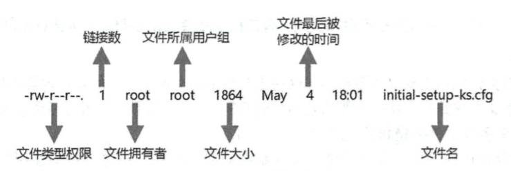
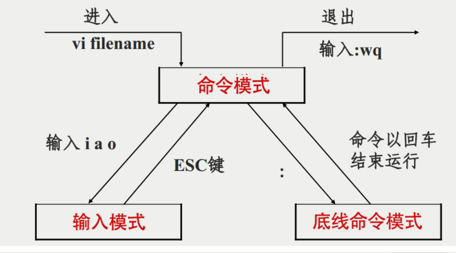

## 一、Linux中的用户与组

* Linux是一个多用户系统，为了方便管理多个用户，又产生了用户组。

  * 每个用户都有唯一的用户名，并且Linux会分配一个唯一的UID与之对应。

  * 同样每个用户组也有唯一的名称，Linux会分配一个唯一的GID给每一个用户组。

  * root用户的uid和gid都是0。

* 用户名与UID的对应关系记录在`/etc/passwd`。

* 用户组与GID的对应关系记录在`/etc/group`。

* 用户的密码信息记录在`/etc/shadow`。（sha256加密）
  * `users` 查看当前用户名
  * `groups`  查看当前用户组

### pwsswd格式

样例：

```tex
root:x:0:0:root:/root:/bin/bash
```

| 列        | 说明                         |
| --------- | ---------------------------- |
| :         | 分隔符                       |
| root      | 用户名                       |
| x         | 早期曾在此记录密码，现已作废 |
| 0         | uid                          |
| 0         | gid                          |
| root      | 注释                         |
| /root     | 家目录                       |
| /bin/bash | 登陆后所使用的Shell          |
| nologin   | 从未登录                     |

### shadow格式

样式：

```tex
root:$1$lrKCOpzq$IHP2BuuKxMdLaBw/:17877:0:99999:7:::
```

| 列                           | 说明                                           |
| ---------------------------- | ---------------------------------------------- |
| root                         | 用户名                                         |
| $1$lrKCOpzq$IHP2BuuKxMdLaBw/ | 密码                                           |
| 17877                        | 最后一次修改密码的日期(该数子从1970-1-1开始记) |
| 0                            | 密码几日内不可修改(为0表示可以随时修改)        |
| 99999                        | 密码有效天数                                   |
| 7                            | 密码失效前几天内提醒用户修改密码               |
|                              | 密码失效的宽限天数                             |
|                              | 账号失效日期                                   |
|                              | 保留字段，暂时无用                             |

### group格式

样例：

```tex
wheel:x:10:bob,tom
```

| 列      | 说明           |
| ------- | -------------- |
| wheel   | 组名           |
| x       | 组密码(已弃用) |
| 10      | 组ID（GID）    |
| bob,tom | 该组的成员     |

## 二、用户管理

### 1.添加用户 

* 用法：`useradd -mU -G 组名 用户名`

  ```tex
  sudo useradd -mU -s /bin/bash -G adm,sudo tom
  
  可以使用快捷命令 (存放在cat ~/.bashrc)
  alias==>别名
  alias crtu="sudo useradd -mU -s /bin/bash -G adm,sudo"
  crtu tom
  
  只在当前终端有效，当端口关闭后该命令失效。
  ```

* 参数详解：

`-G `：`GROUPS` 为新账户的添加用户组列表

`-m`：`/home`目录，创建用户的家目录

`-U`：创建与用户同名的组

`-p `：`PASSWORD`加密后的新账户密码

`-D`：本机默认配置

### 2.修改用户属性

- 用法：`usermod [选项] 用户名`

- 选项：

  `-d HOME_DIR`：用户新的主目录；

  `-g GROUP`：为用户组指定新的组标识号；

  `-G GROUPS`：新的附加组列表GROUP；

  `-a GROUP`：将用户追加至上边提到的附加组中，并不从其他组中删除此用户；

  `-L`：锁定用户账号；

  `-U`：解除用户账号；

  `-m`：将家目录内容移动至新的位置(仅与 -d 一起使用)；

  `-s SHELL`：该用户账号的新登录的shell；

```sql
遇到没有sudo权限无法删除组，切换到到上一个用户：`sudo usermod -aG sudo tom`追加，然后切换进来进行删除。
修改用户账号就是根据实际情况更改用户的有关属性，如用户号、主目录、用户组、登录Shell等。
```

### 3.删除用户

* 用法：`userdel -rf 用户名`

* 参数详解：

  `-r`：删除主目录和邮件池

  `-f`：强制`force`

### 4.修改用户密码

* 用法：`passwd 用户名` 

### 5.切换用户

* 用法一：`su 用户名`：仅仅切换用户身份，但还是位于原始家目录下。
* 用法二：`su - 用户名`：完全以这个用户登录，会初始化当前用户的设置。

### 6.查看信息

* `id`：查看用户个人的uid、gid和组信息
  * `id -u`：查看uid
  * `id -g`：查看gid

## 三、用户组管理

### 1.添加用户组

* 用法：`groupadd [选项] 组名`

* 选项：

  `-g`：`GROUP`为新组使用GID

  `-P`：`PASSWORD`为新组添加此加密过的密码

  `-r`：创建一个系统账户

### 2.强制删除用户组

* 用法：`groupdel -f 组名`

### 3.修改用户组属性

* 用法：`groupmod 选项 用户组`

* 选项：

  `-g GID` ：为用户组指定新的组标识号。

  `-o`：与-g选项同时使用，用户组的新GID可以与系统已有用户组的GID相同。

  `-n`：新用户组 将用户组的名字改为新名字

## 四、查看登陆的用户

| 命令    | 说明                                               |
| ------- | -------------------------------------------------- |
| who     | 查看谁在登录                                       |
| **w**   | **查看谁在登录，并显示每个登录用户正在执行的任务** |
| last    | 查看历史登录记录                                   |
| lastb   | 查看登录失败的记录                                 |
| lastlog | 查看全部用户最后一次登录的时间                     |

## 五、文件权限



### 1.权限的定义

Linux为文件或者目录设置了三种权限：

| 标记 | 含义                    |
| ---- | ----------------------- |
| r    | read，读权限====>4      |
| w    | write，写权限====>2     |
| x    | execute，执行权限====>1 |

同时又规定了不同身份的用户对该文件的权限，用户的身份分为三种：

```tex
1.user		文件拥有者
2.group		同用户组的人
3.other		其他人
```

**使用**`ls -l`或者`ll 文件名(包括隐藏文件)`可以看到文件的权限信息：

```tex
drwxr-xr-x 2 xcw xcw 4096 8月  26 14:11 文档
drwxr-xr-x 2 xcw xcw 4096 8月  26 20:54 下载
drwxr-xr-x 2 xcw xcw 4096 8月  26 14:11 音乐
drwxr-xr-x 2 xcw xcw 4096 8月  27 20:54 桌面
```

最左边一列就是每个文件的权限信息

> 在Linux中第一个字符代表这个文件是目录、文件或链接文件等等。
>
> 当为[ **d** ]则是目录
>
> 当为[ **-** ]则是文件
>
> 若是[ **l** ]则表示为链接文档(link file)
>
> 若是[ **b** ]则表示为装置文件里面的可供储存的接口设备(可随机存取装置)
>
> 若是[ **c** ]则表示为装置文件里面的串行端口设备，例如键盘、鼠标(一次性读取装置)

接下来的字符：以三个一组分成三组，分别是`owner/group/others`三种身份各有自己的的`read/write/execute`权限。

```tex
例：- |rwx|r-x|r-x:
1.rwx：文件拥有者对改文件具有“读、写、可执行”的权限
2.r-x：同组人具有“读、可执行”的权限，没有写权限
3.r--：其他人只有读权限
```

### 2.chmod=权限修改

#### 1)通过符号修改权限

```tex
      | u |	 +(加入)	| r |
chmod | g |  -(除去)	| w |	文件或目录
	  | o |	 =(设定)	| x |
	  | a |
例如：
1.设置自己可读可写可执行，同组可读可执行，其他人可执行：
chmod u=rwx,g=rx,o=x test.py
2.给自己和同组人增加读写权限：
chmod ug+rw test.py
3.给同组人和其他人删除写权限：
chmod go-x test.py
4.给所有人增加执行权限：
chmod a+x test.py
```

**a 代表 all，u 代表文件拥有者，g 同组人，o 其他人**

| 符号 | 说明                 |
| ---- | -------------------- |
| +    | 为文件或目录增加权限 |
| -    | 删除文件或目录的权限 |
| =    | 设置指定的权限       |

**换行输出：echo -e 'hello \n world!'**

#### 2)通过数字修改权限

| 十进制数字 | 二进制 |                     说明                     | 权限 |
| :--------: | :----: | :------------------------------------------: | :--: |
|     0      |   0    |                 没有任何权限                 | ---  |
|     1      |   1    |                   执行权限                   | --x  |
|     2      |   10   |                   写入权限                   | -w-  |
|     3      |   11   | 执行权限和写入权限：1 (执行) + 2 (写入) = 3  | -wx  |
|     4      |  100   |                   读取权限                   | r--  |
|     5      |  101   |   读取和执行权限：4 (读取) + 1 (执行) = 5    | r-x  |
|     6      |  110   |   读取和写入权限：4 (读取) + 2 (写入) = 6    | rw-  |
|     7      |  111   | 所有权限: 4 (读取) + 2 (写入) + 1 (执行) = 7 | rwx  |

### 3.chown=修改文件拥有者

用法：
`chown 用户名:组名 文件名`

**一对反引号表示优先执行**

```tex
chown -R `id -u`:`id -g` 文件名        
同时修改文件所有者和组

chown [–R] 属主名 文件名
```

> -R：递归更改文件属组，就是在更改某个目录文件的属组时，如果加上-R的参数，那么该目录下的所有文件的属组都会更改。

### 4.chgrp=更改文件拥有组

```
语法：
chgrp [-R] 属组名 文件名
```

## 六、文本操作

```tex
echo abc.txt : 打印⽂本
echo 'hello' > abc.txt : 将输出的⽂本重定向到⽂件abc.txt中,abc.txt原有内容会被覆盖
echo 'hello' >> a.txt : 将输出的⽂本追加到⽂件a.txt中，a.txt原有内容不会被覆盖

cat ⽂件名 : 查看⽂件

head -n N ⽂件名 : 查看⽂件的前 N ⾏(不带-n N默认查看文件前10行)
tail -n N ⽂件名 : 查看⽂件的后 N ⾏(不带-n N默认查看文件后10行)

less ⽂件名 : 快速浏览⽂件
		按 j 向下
		按 k 向上
		按 f 向下翻屏
        按 b 向上翻屏
        按 g 到全⽂开头
        按 G 到全⽂结尾
        按 q 退出
/ 查找      
sort ⽂本或⽂件 : 将结果按升序排序(-n 按数字排序  -r 降序输出)，默认按首字母;
uniq 只能去除(连续重复), 依赖排序, 常跟在 sort 后⾯使⽤;

awk '{print $N}' 打印出相关列

wc 字符统计
参数：
-c : 统计字符(英文字母)
-w : 统计单词
-l : 统计⾏
例如: 统计代码⾏数 wc -l abc.py

管道符: |
   管道符可以连接两个命令，将前⾯的输出作为后⾯的输⼊
        history|grep useradd   
            查找所有的useradd命令；
        history|grep -A 3 useradd   
            查找所有useradd命令的后3个命令；
        history|grep -B 3 useradd   
            查找所有useradd命令的前3个命令；
        history|grep -C 3 useradd   
            查找所有useradd命令的前后3个命令；
        history|grep -E 'user*'	
            正则表达式匹配，查找所有user开头的命令；	
文本过滤：grep
	参数：
		-i:忽略大小写
		-I:忽略二进制文件
		-r:递归查找目录
		-n:打印行号
		-c:只显示匹配到的个数
		-l:只显示匹配到的文件列表
		-o:只显示匹配到的单词
		-v:忽略指定的字段
		-E:通过正则表达式
		--include='*.py'  仅包含py文件
		--exclude='*.js'  不包含js文件

练习: 统计出终端使⽤的最多的 10 个命令
history | awk '{print $2}' | sort | uniq -c | sort -rn | head -n 10
取出历史命令的第二列(第一列是数字序号，第二列是命令)，按首字母a-z排序，去除重复的并计数(现在前面有数字序号)，按数字序号逆序排序(从大到小)，再取出前10行。
history | awk '{print $2}' | sort | uniq -c | sort -gr | head -n 10
```

## 七、vim

VIM 分为三种模式：**命令模式，插⼊模式，底栏命令模式**



**1.按 esc 键，进入命令模式**

```tex
h，i, k, l 光标左、下、上、右移动
ctl + e 向下滚动
ctl + y 向上滚动
ctl + f 向下翻屏
ctl + b 向上翻屏
yy 复制整⾏    yw 复制整⾏
大写 p 粘贴到上⼀⾏
小写 P 粘贴到下⼀⾏
dd 删除整⾏
d3w 向前删除3个单词
7x 删除7个字符
u 撤销
ctl + r 重做
c3w 剪切3个单词
gg 跳⾄⽂件⾸⾏
shift + g 跳⾄⽂件结尾
shift + h 跳⾄屏幕⾸⾏
shift + m 跳⾄屏幕中间
shift + l 跳⾄屏幕结尾

ctrl + v 可视块，可使用左右方向键
    按x删除#，即可取消注释
    shift + i输入#，连按两次esc退出选中状态即可注释

shift + v 选中整行
shift + 连按两次> 向右缩进
shift + 连按两次< 向左缩进
```

**2.按 i 键，进入插入模式下正常输入即可,想做其他操作，必须先按 ESC 键回到命令模式**

**3.在命令模式时按 : 键**

```tex
:23 进入底栏命令模式至⽂件的第 23 行
:%s/abc/123/g  把⽂件中所有的 abc 替换成 123
:set nu 打开⾏号
:set nonu 关闭⾏号
:w 保存
:q 退出
:wq 保存并退出
:q! 强制退出
```


