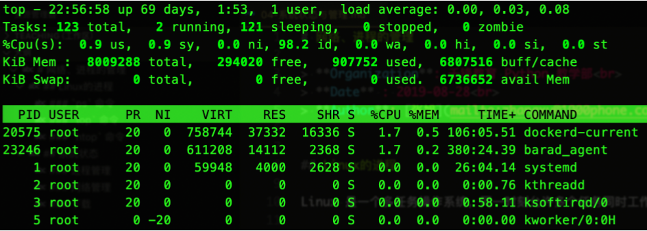
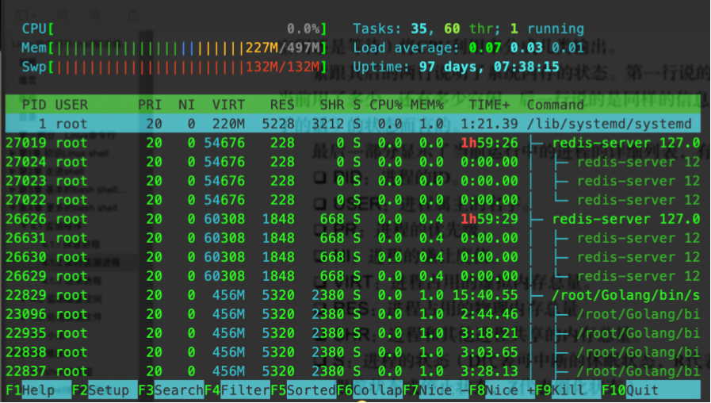

## 一、进程状态

Linux是一个多任务操作系统，同一时刻允许多个任务同时工作，运行中的每一个任务就是一个进程。

### `ps`命令

**ps (process status)，用来查看当前敲击键盘一瞬间进程状态。**

ps不带参数：

```tex
xcw@xcw-VirtualBox:~$ ps
  PID TTY          TIME CMD
 1929 pts/0    00:00:00 bash
 1941 pts/0    00:00:00 ps
```

ps 命令选项：

| 选项 | 说明                           |
| ---- | ------------------------------ |
| -a   | 显示所有用户的所有进程。       |
| -x   | 显示无终端的进程。             |
| -u   | 显示更多信息，类似于 -f 选项。 |
| -e   | 显示所有进程。                 |
| -f   | 查看更多信息，f 是 full 的缩写 |

#### 1.`ps -ef`

```tex
xcw@xcw-VirtualBox:~$ ps -ef
UID    PID  PPID  C STIME TTY          TIME CMD
root     1     0  1 20:54 ?        00:00:01 /sbin/init splash
root     2     0  0 20:54 ?        00:00:00 [kthreadd]
root     3     2  0 20:54 ?        00:00:00 [rcu_gp]
root     4     2  0 20:54 ?        00:00:00 [rcu_par_gp]
root     5     2  0 20:54 ?        00:00:00 [kworker/0:0-ata]
root     6     2  0 20:54 ?        00:00:00 [kworker/0:0H-kb]
root     7     2  0 20:54 ?        00:00:00 [kworker/u2:0-ev]
```

| 列    | 描述                      |
| ----- | ------------------------- |
| UID   | 启动这些进程的用户ID      |
| PID   | 进程ID                    |
| PPID  | 父进程的进程号            |
| C     | 进程生命周期中的CPU利用率 |
| STIME | 进程启动时的时间          |
| TTY   | 进程启动时的终端设备      |
| TIME  | 程序累计占用CPU           |
| CMD   | 进程运行的命令            |

#### 2.`ps aux`

```tex
xcw@xcw-VirtualBox:~$ ps aux
USER  PID %CPU %MEM    VSZ   RSS TTY      STAT START   TIME COMMAND
root    1  0.5  0.4 159796  8892 ?        Ss   20:54   0:01 /sbin/init spla
root    2  0.0  0.0      0     0 ?        S    20:54   0:00 [kthreadd]
root    3  0.0  0.0      0     0 ?        I<   20:54   0:00 [rcu_gp]
root    4  0.0  0.0      0     0 ?        I<   20:54   0:00 [rcu_par_gp]
root    5  0.0  0.0      0     0 ?        I    20:54   0:00 [kworker/0:0-at
root    6  0.0  0.0      0     0 ?        I<   20:54   0:00 [kworker/0:0H-k
root    7  0.0  0.0      0     0 ?        I    20:54   0:00 [kworker/u2:0-e
```

| 列      | 描述                                       |
| ------- | ------------------------------------------ |
| USER    | 执行这个进程的用户                         |
| PID     | 进程ID                                     |
| %CPU    | 当前进程的CPU占用                          |
| %MEM    | 当时进程的内存占用                         |
| VSZ     | 进程占用的虚拟内存大小，以千字节(KB)为单位 |
| RSS     | 进程占用的物理内存大小多少页               |
| TTY     | 进程启动时的终端设备                       |
| STAT    | 进程状态                                   |
| START   | 进程启动时刻                               |
| TIME    | 程序累计占用CPU时间                        |
| COMMAND | 启动进程的命令                             |

关于`STAT`：代表当前进程状态的双字符状态码。

* 第一个字符表明进程状态：
  * `o`：代表正在运行
  * `S`：代表在休眠
  * `R`：代表可运行，正等待CPU
  * `Z`：代表僵化，进程已结束但父进程已不存在
  * `T`：代表停止
* 第二个参数进一步说明进程的状态细节：
  * `<`：该进程运行在高优先级上
  * `N`：该进程运行在低优先级上
  * `L`：该进程有页面锁定在内存中
  * `s`：该进程是控制进程
  * `l`：该进程是多线程
  * `+`：该进程运行在前台

### `top`命令

**持续查看动态进程的状态**



* top - 头信息解释：
  * 1.系统运行的整体状态：当前时间、开机时长、登录用户数，系统负载
    * 系统负载：`load average：0.00，0.02，0.05`
    * 分别代表：一分钟负载、五分钟负载、十五分钟负载
    * **负载值不要超过CPU的核心数，如果超过核心数意味着有很多进程在等待使用CPU。**
    * 负载值越高代表服务器压力越大
    * 与`uptime`命令的结果一样(查看系统状态)
  * 2.Task:  任务情况
    * `totals`任务总数，
    * `running`运行中的数量，
    * `sleeping`休眠数量，
    * `stopped`停止数量，
    * `zombie`僵尸进程数量
  * 3.CPU使用情况：
    * **us**：(user)用户态占用
    * **sy**：(system)内核态占用
    * **id**：(id)空闲的CPU
  * 4.`KiB Mem`内存占用情况：内存总量，空闲内存，使用的内存，缓冲区占用的内存
  * 5.交换分区`KiB Swap`的占用：
    * **交换分区是一种将内存数据保存到硬盘的技术，一般在内存不足时使用。**
    * windows虚拟内存，只是声明一块内存，等真正使用时才会分配。
* 进程区解释：

| 列      | 描述                                         |
| ------- | -------------------------------------------- |
| PID     | 进程ID                                       |
| USER    | 进程属主的名字                               |
| PR      | 进程优先级                                   |
| NI      | 进程的谦让度值                               |
| VIRT    | 进程占用的虚拟内存总量                       |
| RES     | 进程占用的物理内存总量                       |
| SHR     | 进程和其他进程共享的内存总量                 |
| S       | 进程的状态（与ps基本相同）                   |
| %CPU    | 进程使用的CPU时间比例                        |
| %MEM    | 进程使用的内存占可用内存的比例               |
| TIME+   | 自进程启动到目前为止CPU时间总量              |
| COMMAND | 进程所对应的的命令行名称，也就是启动的程序名 |

* 备注：

可以通过 -p 参数指定需要查看的进程ID，让进程信息更简洁：

```tex
top -p PID1,PID2,PID3......
```

### `htop`命令

htop不是系统默认的命令，需要安装：`sudo apt install htop`



可以通过鼠标操作

F3Search查询进程

F4Filter过滤进程

F9kill杀死进程

## 二、处理进程

* `kill`：**杀死进程，或者给进程发送信号signal**
  * `-1 (HUP)`平滑重启
  * `-9 (KILL)`强制杀死进程
  * `-15 (TERM)`正常终止进程(kill的默认信号)

* `pkill [进程名]`   按名字处理进程

* `killall [MatchedProcessName]`   终止名字匹配的进程

## 三、其他状态

### 1.内存状态`free`

**可以通过 `-m` (M)或 `-g`(G内存换算有偏差)参数调整free命令显示数值的单位。**

```tex
xcw@xcw-VirtualBox:~$ free
          总计       已用      空闲      共享    缓冲/缓存    可用
内存：   2038860   1198352    72176   17328     768332     670644
交换：   969960          0   969960
```

### 2.硬盘

* `iostat`：查看硬盘写入和读取的状态`sudo apt install sysstat`
* `df -lh`：查看硬盘分区，及每个分区的剩余空间
* `du -hs ./`：查看当前目录占用的硬盘大小`-s总计，即显示当前文件大小`

### 3.网络状态

* `ifconfig`查看(设置)网卡状态，常用来检查自身IP地址

* `netstat -natp`**查看网络连接状态**

  * `sudo netstat -natp|grep 3306`：**查看端口占用的程序**
  * `-a`：显示所有选项

  * `-t`：显示所有与TCP相关的选项

  * `-u`：显示所有与UDP相关的选项

  * `-x`：显示所有与Unix域相关的套接字选项

  * `-n`：拒绝显示别名，能显示数字的全部转换为数字显示

  * `-p`：显示建立相关连接的程序名

  * `-l`：显示所有状态为Listen的连接

  * `-e`：显示所有扩展信息，如当前链接所对应的用户

  * `-c`：间隔一段时间执行一次netstat命令

  * `-s`：显示统计信息，对每种类型进行汇总

* `ping -i 0.5 -c 100 xx.xx.xx.xx`用于检测网络速度。
  
  使用ICMP传输协议，发出要求回应的信息，若远端主机的网络功能没有问题，就会回应该信息，因而得知该主机运作正常。
  
  * `-i`：间隔
  * `-c`：数量
  * `-q`：安静模式，只打印结果
  
* `lsof`（list open files）列举系统中已经被打开的文件。

  * `lsof -i :[PORT]`查看占用端口的程序(网络也是文件)

  * `losf -i tcp`查看所有TCP连接

  * `lsof -u user` 查看用户user打开的所有文件

  * `lsof -p 123`查看pid为123的进程打开的所有文件

* 路由追踪：`traceroute [HOST]`

* DNS 域名解析查询  baidu.com
  * `dig	[DOMAIN]`
  * `host [DOMAIN]`
  * `nslookup [DOMAIN]`

### 4.时间和日期

* `date`：查看日期与时间

* `cal`：查看日历
  * `-1`：查看本月的日历
  * `-3`：查看最近三个月的日历
  * `2019`：查看全年的日历

### 5.下载

* `curl`执行HTTP访问，也可用来下载 重定向

  `curl https://www.baidu.com`百度的HTML网页源代码

  `curl http://nginx.org>nginx.tgz`重定向

* 远程登录：`ssh python1905@10.11.55.119`密码：123456

* scp在服务器之间

  * 上传：

    `scp  ./some.log python1905@10.11.55.119:/home/python1905/`

  * 下载：

    `scp  python1905@10.11.55.119:/home/python1905/ some.log`

* `wget +软件源地址`下载
