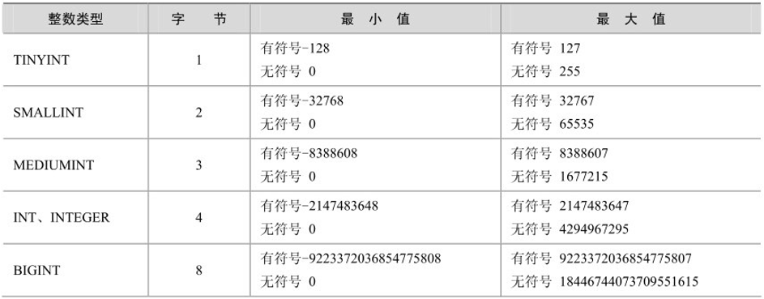
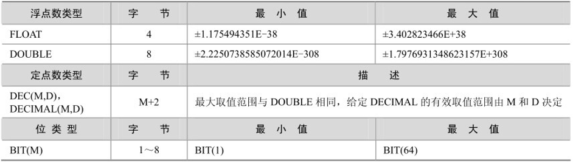
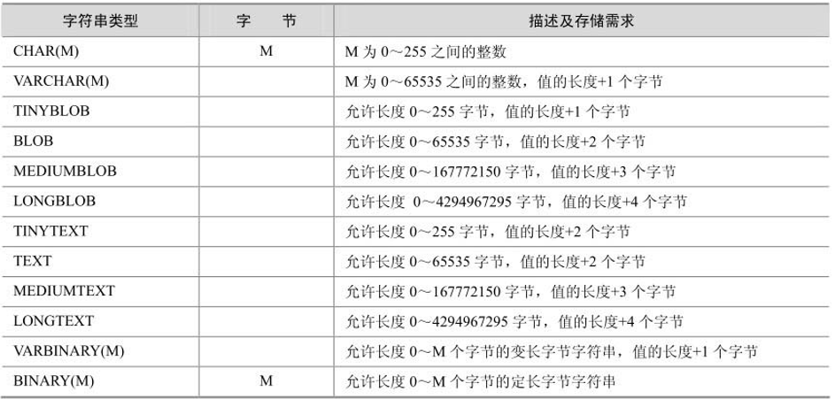
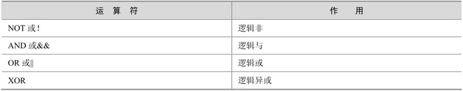

# 一、字符集

## 1、字符集作用:

* 保存数据需要使用字符集

* 数据传输需要使用字符集

* 存储的时候需要字符集
  * 在数据库中，在表的使用上
  * 在服务器安装的时候，可以指定默认的字符集

## 2、常见字符集：

* ASCII：基于罗马字符表的一套字符集，它采用1个字节的低7位表示字符，高位始终为0。
* LATIN1：相对于ASCII字符集做了扩展，任然使用一个字节表示字符，但启用了高位，扩展了字符集。
* GB2312：简体中文字符，一个汉字最多占用2个字节（3000多个汉字）。
* GBK：支持所有的中文字符(繁体)，一个汉字最多占用2个字节。
* UTF8：国际通用编码，一个汉字最多占用3个字节。
* UTF8MB4：在utf8的基础上加强了对新文字的识别，一个汉字最多占用4个字节。

```sql
/*gbk字符集最大字符串长度：65535/2-1*/
create table test1(
	text varchar(32767)
) charset=gbk;

/*utf8字符集最大字符串长度：65535/3-1*/
create table test2(
	text varchar(21844)
) charset=utf8;

/*utf8mb4最大字符串长度：65535/4-1*/
create table test3(
	text varchar(16382)
) charset=utf38mb4;

```

## 3、查看当前MySQL支持的字符集

```sql
mysql> show variables like 'character_%';

/*  输出结果
+--------------------------+----------------------------+
| Variable_name            | Value                      |
+--------------------------+----------------------------+
| character_set_client     | utf8                       |	客户端来源数据使用的字符集
| character_set_connection | utf8                       |	连接层字符集
| character_set_database   | latin1                     |	当前选中数据库的默认字符集
| character_set_filesystem | binary                     |	文件系统字符集
| character_set_results    | utf8                       |	查询结构使用的字符集
| character_set_server     | latin1                     |	默认的内部操作字符集
| character_set_system     | utf8                       |	系统源数据(字段名、表名等)的字符集
| character_sets_dir       | /usr/share/mysql/charsets/ |
+--------------------------+----------------------------+
*/
```

## 4、修改当前的MySQL系统的字符集编码

* 全部修改

  ```sql
  set names gbk;
  ```

* 指定修改

  ```sql
  set character_set_client = gbk;--修改客户端来源数据使用的字符集
  set character_set_results = gbk;--修改查询结果使用的字符集
  ```

* 它是临时命令，MySQL连接断开以后，再次连接会恢复原状

# 二、校对集

**概念：**在某一种字符集下，为了**使字符之间可以互相比较**，让字符和字符形成一种关系的集合，称之为校对集。

例：比如ASCII码中的a(97)和B(66),如果区分大小写a>B,如果不区分a<B;

不同字符集有不同的校对规则, 命名约定:以其相关的字符集名开始, 通常包括一个语言名, 并且以

`_ci` 、` _cs `或 `_bin`结束。

* `_ci `: 大小写不敏感 ignore
* `_cs` : 大小写敏感
* `_bin` : binary collation 二元法, 直接比较字符的编码, 可以认为是区分大小写的, 因为字符集
  中'**A**'和'**a**'的编码显然不同。

```sql
/* 数据库默认的排序方式，是升序 */
create table t1(
	str char(1)
) charset=utf8mb4 collate=utf8mb4_general_ci;
-- _general_ci 后缀的都是不区分大小写的

create table t2(
	str char(1)
)charset=utf8mb4 collate=utf8mb4_bin;
-- 看到后缀边是_bin的都是区分大小的

/* 
Linux中MySQL是区分大小的
需要自己去配置
vim /etc/mysql/my.cnf
找到[mysqld]
1是不区分大小写,0是区分大小写
*/
lower_case_table_names=1
```

```sql
show character set; -- 查看字符集 和 校对集
show collation;     -- 显示所有的校对集
```

# 三、MySQL数据类型

## 1.整型



*  **一个无符号数一定是非负数**

  ```sql
  create table t3(
  	age tinyint unsigned
  );
  ```

* **显示宽度(zerofill)**

  ```sql
  -- 整型显示宽度，位数不足时用 0 填充。
  create table t4(
  	id int(10) zerofill primary key auto_increment;
      name char(32)
  );
  insert into t4 values(12345,'5个');
  insert into t4 values(1234567890,'10个')
  /*insert into t4 values(123456789012,'12个')*/ -- 报错
  select * from t4;
  /* 输出
  +------------+------+
  | id         | name |
  +------------+------+
  | 12345      | 5个  |
  | 1234567890 | 10个 |
  +------------+------+
  */
  ```

## 2.浮点型



定点数的位数更加长。

使用方式：

* float(M,D)
* double(M,D)
* decima(M,D)
* M 是支持多少个长度，D是小数点后面的位数。

```sql
create table table t5(
	a float(10,2),
    b float(10,2),
    c decimal(10,2)
);
```

## 3.字符串类型



`char`和`varchar`的区别：BLOB二进制、单行存储长度有限制

| 类型       | 输入      | 在数据库存储 | 大小    | 描述                                    |
| ---------- | --------- | ------------ | ------- | --------------------------------------- |
| char(5)    | "a"       | "a     "     | 5 bytes | 固定占5个字节，不足的用空格补齐         |
| varchar(5) | "a"       | "a"          | 2 bytes | 字符占1个字节，额外用1个字节记录位长    |
| char(5)    | "abc  "   | "abc  "      | 5 bytes | 保留结尾空格，依然占5个字节             |
| varchar(5) | "abc  "   | "abc"        | 4 bytes | 删除结尾空格，再加位长记录，共占4位字节 |
| char(5)    | "abcdefg" | "abcde"      | 5 bytes | 截掉超出的字符，会报错                  |
| varchar(5) | "abcdefg" | "abcde"      | 6 bytes | 截掉超出的字符，会报错                  |

**注意：数据类型不是越大越好，越大的类型会造成数据臃肿，存储空间占用过大，数据检索速度变慢。**

## 4.枚举(enum)

多选一的时候使用的一种数据类型；在前端使用单选框的时候，枚举类型可以发挥作用。

枚举类型的优点：

* 限制了可选值
* 节省空间
* 运行效率高

```sql
create table t6(
	name vachar(32),
    sex enum('男','女','保密') default '保密'
)charset=utf8;

-- 枚举类型的计数默认从1开始
insert into t6 set name='王宝强',sex='男';
/*
+--------+-----+
| name   | sex |
+--------+-----+
| 王宝强  | 男  |
+--------+-----+
*/
```

## 5.集合(set)

set最多可以有64个不同的成员。类似于复选框，有多少可以选多少。

```sql
create table t7(
	name varchar(32),
    hobby set('吃','喝','玩','睡','开车')
)charset=utf8;

insert into t7 values('张三','睡,玩,喝')
insert into t7 values('李四','睡,开车')
```

实际问题：

```sql
为什么不用set类型：在网站开发中，多选框的值有上千个，值存储空间没有索引用的多
复选框问题如何解决：将复选框的值单独设计成一张表。
```

## 6.时间类型


### 1、datetime

```sql
create table datetime_test(
	create_at datetime
);

insert into datetime_test values('2019-9-3 22:09:10');
insert into datetime_test values('2019/9/3 22:09:10');
insert into datetime_test values(now());
-- 年份最大支持4个长度
insert into datetime_test values('10000/9/3 22:09:10'); -- 报错，超过范围
insert into datetime_test values('9999/9/3 22:09:10');
```

### 2、time(时:分:秒)

```sql
create table time_test (
	create_at time
);
insert into time_test values('12:12:12');
insert into time_test values('100:12:12');--超过12，换算成天数
insert into time_test values('-100:12:12');
insert into time_test values('10 10:12:12');
-- [-838:59:59-838:59:59]
/*insert into time_test values('839:12:12'); -- 报错*/

/*
+-------------------+
| create_at         |
+-------------------+
| 12:12:12          |
| 4 days, 4:12:12   |	100:12:12 = 4 days, 4:12:12
| -5 days, 19:47:48 |	19:47:48+100:12:12 = 5 days
| 10 days, 10:12:12 |	10 10:12:12 = 10 days, 10:12:12
+-------------------+
*/
```

### 3、timestamp时间戳类型

* 时间戳类型在显示方面和datetime是一样的，但在存储上不一样
* 范围从【1970-1-1 0:0:0 到 2038-1-19 11:14:07】
* 时间戳使用4个字符表示
* 该值大小与存储的位长有关：2 ** (4 * 8 -1)

```sql
create table timestamp_test(
	create_at timestamp
);

insert into timestamp_test values(now());
insert into timestamp_test values('2038-1-19 11:14:07');
/*insert into timestamp_test values('2038-1-19 11:14:08');--报错*/
```

### 4、year年份

```sql
create table `year`(
	create_at year
);
-- 从1900年年开始   1900+255=2155
insert into `year` values(now());
insert into `year` values('2155');
insert into `year` values('2156'); -- 报错
+-----------+
| create_at |
+-----------+
| 2019      |
| 2155      |
+-----------+
```

## 7.布尔型

```sql
/*mysql中的bool类型也是1和0，底层用int*/

create table `bool`(
	cond boolean
);
insert into `bool` set cond=True; -- 成功
insert into `bool` set cond=False; -- 成功
insert into `bool` set cond=1; -- 成功
insert into `bool` set cond=10; -- 成功
insert into `bool` set cond=-1; -- 成功
insert into `bool` set cond=0; -- 成功
insert into `bool` set cond=0.1; -- 成功
insert into `bool` set cond='True'; -- 失败，底层用的是int,字符串无法转换为整型
+------+
| cond |
+------+
| 1    |
| 0    |
| 1    |
| 10   |
| -1   |
| 0    |
| 0    |
+------+
```

## 8.列的属性

### null是否为空

* `null` : 是可以为空,默认不写
* `not null` : 不可以为空,如果插入的时候,某个字段的值为空,则报错

```sql
create table null_test (
	id int primary key auto_increment,
	username varchar(32) not null,
	pwd varchar(16) null
);

insert into  null_test values(null,null,null);
```

### default默认值

* 一般是和null做搭配

```sql
create table default_test (
	id int primary key auto_increment,
	username varchar(32) default 'admin' not null,
	pwd varchar(16) default 123456
);

insert into default_test (username) values ('admin');
```


### auto_increment自动增长

* 自动增长的列
* 默认从 1 开始
* 常配合主键使用
* **只能用于整型**

```sql
create table auto_inc (
id int primary key auto_increment,
name varchar(32)
);
insert into auto_inc (name) values ('aaa'), ('bbb'), ('ccc');

select * from auto_inc;
/* 输出:
+----+------+
| id | name |
+----+------+
| 1 | aaa 	|
| 2 | bbb 	|
| 3 | ccc 	|
+----+------+
*/
```

### primary key主键

* 一般是唯一的标识
* 特性:不能为空,也**不能重复**,一张表当中只可以拥有一个主键

```sql
-- 这里只有一个主键,这种主键叫做联合主键, 在项目中使用用较少
create table double_pri_test (
id int,
sid int,
primary key(id,sid)
);
insert into double_pri_test values (1, 1);
insert into double_pri_test values (1, 2); -- 成功
insert into double_pri_test values (2, 1); -- 成功
insert into double_pri_test values (1, 1); -- 失败
```

### unique唯一键

* 保证列当中的每一个数据都不重复

```sql
/*ID不可以重复,手机号不可以重复*/

create table test_uniq (
	id int auto_increment primary key,
	mobile char(11) unique
);
insert into test_uniq set mobile=13999999999;
```

### comment注释

*  给开发者看的, 用来对相应字段进行说明

```sql
create table test_cmt (
	ctime datetime comment '这个字段代表创建日期'
);
```

## 9.SQL注释

* 单行注释: `-- 报错`

* 多行注释: `/*   */`

* MySQL 独有的单行注释:  `# 注释`

# 四、MySQL的运算符

## 算术运算符

```sql
select 123 + 543, 321 * 5, -456 / 2, 10 % 3, 2 / 0, 3 % 0;
/*输出：
+-----------+---------+-----------+--------+--------+--------+
| 123 + 543 | 321 * 5 | -456 / 2  | 10 % 3 | 2 / 0  | 3 % 0  |
+-----------+---------+-----------+--------+--------+--------+
| 666       | 1605    | -228.0000 | 1      | <null> | <null> |
+-----------+---------+-----------+--------+--------+--------+
*/

```

## 比较运算符

* **常规比较**

```sql
select 1=2,2<3,3<=4,4>=5,5>=3,8!=9,8<>9,'abc'='Abc','z'>'a';
/*输出：
+-----+-----+------+-----+------+------+------+---------------+-----------+
| 1=2 | 2<3 | 3<=4 | 4>5 | 5>=3 | 8!=9 | 8<>9 | 'abc' = 'Abc' | 'z' > 'a' |
+-----+-----+------+-----+------+------+------+---------------+-----------+
| 0   | 1   | 1    | 0   | 1    | 1    | 1    | 1             | 1         |
+-----+-----+------+-----+------+------+------+---------------+-----------+
*/
```

* **范围比较**

```sql
select between 100 and 200 , 'b' in ('a','b','c');
/*输出：
+-------------------------+------------------------+
| 123 between 100 and 200 | 'b' in ('a', 'b', 'c') |
+-------------------------+------------------------+
| 1                       | 1                      |
+-------------------------+------------------------+
*/
```

* **null比较**

```sql
select 12 is null,23 = null,null = null,null <=> null,null is null,32 is not null;
/*输出：
+------------+-----------+-------------+---------------+--------------+-------------+
| 12 is null | 23 = null | null = null | null <=> null | null is null | 32          |
|            |           |             |               |              | is not null |
+------------+-----------+-------------+---------------+--------------+-------------+
| 0          | <null>    | <null>      | 1             | 1            | 1           |
+------------+-----------+-------------+---------------+--------------+-------------+
*/
```

* **模糊比较：like**

```sql
select 'Helloworld' like 'hello%';
/*     %匹配多为  _只匹配一位
+----------------------------+
| 'HelloWorld' like 'hello%' |
+----------------------------+
| 1                          |
+----------------------------+
*/
```

## 逻辑运算符



```sql
select 123 and 0,123 or 0,123 and 456,!123,not 123; 
/*  输出
+-----------+----------+-------------+------+---------+
| 123 and 0 | 123 or 0 | 123 and 456 | !123 | not 123 |
+-----------+----------+-------------+------+---------+
| 0         | 1        | 1           | 0    | 0       |
+-----------+----------+-------------+------+---------+
*/
```

位运算符
