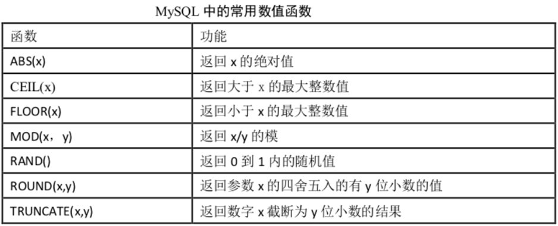
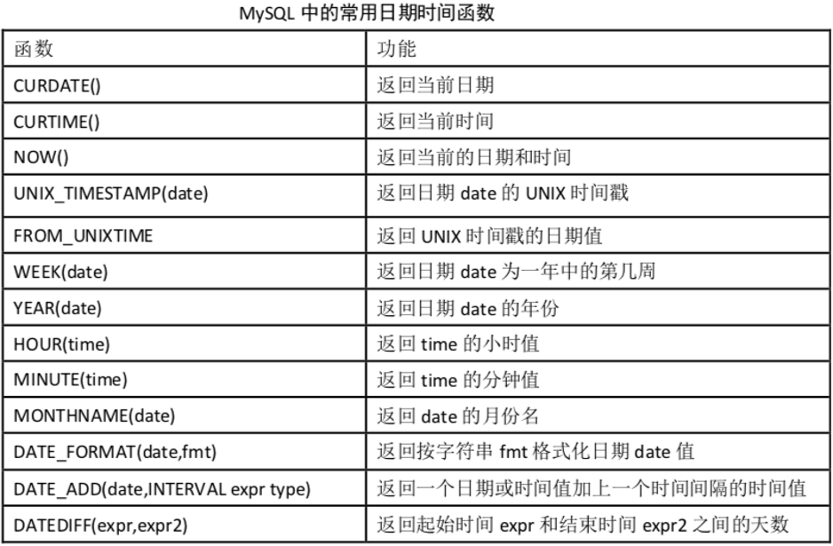
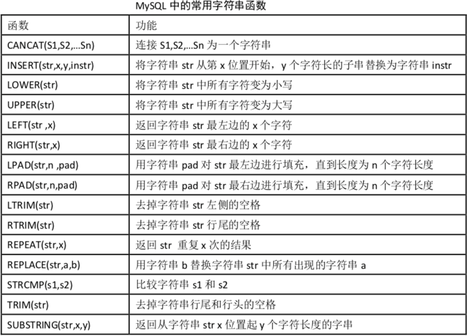
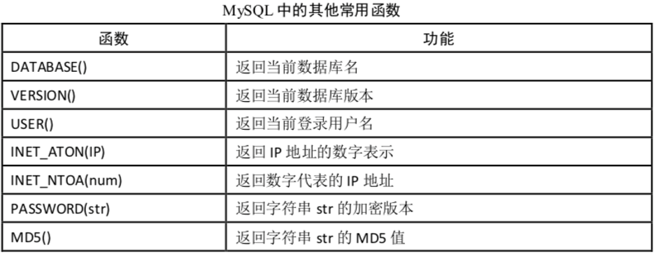
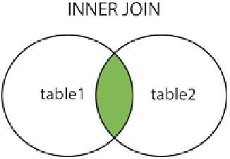
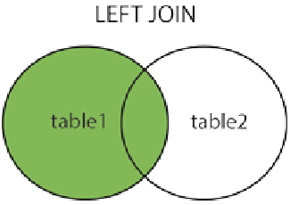
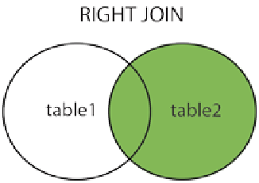

## 六个关键字的顺序：

select ...
	from ...
	where ...
	group by ...
	having ...
	order by ...

## 一、构造数据

```sql
create database weekday3;

use weekday3;

create table student(
	id int unsigned primary key auto_increment,
    name char(32) not null unique,
    sex enum('男','女') not null,
    description text,
    birthday date not null default '1995-1-1',
    only_child boolean
) charset=utf8;

insert into student
('郭德纲', '男', '北京', '班长', '1997/10/1', True),
('陈乔恩', '女', '上海', NULL, '1995/3/2', True),
('赵丽颖', '女', '北京', '班花, 不骄傲', '1995/4/4', False),
('王宝强', '男', '重庆', '阳光大男孩, 超爱吃火锅', '1998/10/5', False),
('赵雅芝', '女', '重庆', '全宇宙三好学生', '1996/7/9', True),
('张学友', '男', '上海', '全国数学奥林匹克竞赛冠军! 还有谁!', '1993/5/2', False),
('陈意涵', '女', '上海', NULL, '1994/8/30', True),
('赵本', '男', '南京', '副班长', '1995/6/1',True),
('张柏芝', '女', '上海', '这家伙很勤奋, 但还是什么都没留下。。。', '1997/2/28',False)
('吴亦凡', '男', '南京', '大碗宽面要不要?', '1995/6/1',True),
('鹿鹿晗', '男', '北京', NULL, '1993/5/28', True);
('关晓彤', '女', '北京', NULL, '1995/7/12',True)
('周杰伦', '男', '台北北', '小伙人才啊', '1998/3/28', False);
('⻢云', '男', '南京', '一个字:真丑,两个字:贼有钱', '1990/4/1',False),
('⻢化', '男', '上海', '深圳小马哥,马云死对头', '1990/11/28', False);

create table score(
	id int unsigned primary key auto_increment,
    math float not null default 0,
    english float not null default 0
) charset=utf8;
insert into score (`math`, `english`)
values
(49, 71), (62, 66.7), (44, 86), (77.5, 74), (41, 75),
(82, 59.5), (64.5, 85), (62, 98), (44, 36), (67, 56),
(81, 90), (78, 70), (83, 66), (40, 90), (90, 90);
```

## 二、查询语句

### 1.select：字段表达式

* `select` **既可以做查询，也可以做输出**。
* 例如：

```sql
select rand(); 			 -- 随机数
select unix_timestamp(); -- 显示Unix时间戳

select id, name from student;
```

```sql
select id,name from student;
-- 按照 name 第一个字的 Unicode编码排序
/*
+----+--------+
| id | name   |
+----+--------+
| 1  | 刘邦   |
| 3  | 张国荣 |
| 7  | 张学友 |
| 10 | 张柏芝 |
| 5  | 王宝强 |
| 4  | 赵丽颖 |
| 9  | 赵本山 |
| 6  | 赵雅芝 |
| 2  | 陈乔恩 |
| 8  | 陈意涵 |
+----+--------+
*/
 explain select id,name from student;
/*
+------+
| key  | 
+------+
| name | 
+------+
*/
```

### 2.from 子句

* `select 字段 from 表名;`
* `from `后面是**数据源**可以写多个，数据源一般是表名，也可以是其他select查询结果集。
* 例如：

```sql
select student.name, score.math from student,score;
--笛卡尔积
```

### 3.where子句：按指定条件过滤

* `select 字段 from 表名 where 条件;`
* where 是做条件查询，只返回结果为True的数据。
* 例如：

```sql
select name from student where city = '上海';
```

* 空值判断：`is null  /   is not null`

```sql
select name from student where description is null;
select name from student where description is not null;
```

* 范围判断：`between ... and ... /  not between ... and ...`

```sql
select id, math from score where math between 60 and 70;
select id, math from score where math not between 60 and 70;
-- 也可用比较运算符
select * from score where math >= 80 and english<=60;
```

### 4.group by：分组查询

* **概念：**按照某一字段进行分组，会把该字段中的值相同的归为一组，将查询的结果分类显示，方便统计。
* **如果有group by要放在where的后面。**
* 语法：`select 字段名 from 表名 group by 分组字段;`
* 例如：

```sql
select sex, count(id) from student group by sex;

-- 在group将需要的结果通过 "聚合函数" 拼接
select sex, group_concat(name) from student group by sex;

-- 添加where语句
-- 按性别分组，将上海地区的男生女生姓名连接起来
select sex, group_concat(name) from student where city = '上海' group by sex;
```

### 5.having

* **在SQL中增加 having 子句的原因是：**`where`关键字后面无法与聚合函数一起使用。
* 语法：`select 字段 from 表名 having 条件;`
* `where`：后面不能加上聚合函数，只能写在数据源的后面。
* `having`：select 查询的条件字段必须要在结果集中出现，可以写在`group by`的后面。
* 例如：

```sql
select `name`, `birthday` from `student` where `birthday` > '1995-1-1';
select `name`, `birthday` from `student` having `birthday` > '1995-1-1';
select `name` from `student` where `id` >= 5;

select `name` from `student` having `id` >= 5;  -- 错误,having过滤字段不在select查询的条件字段内

select * from student where id>=3 and city='北京';
select * from student having id>=3 and city='北京';
/*混合使用*/
select * from student where id>=3 having city='北京';

-- 取出每个城市中满足最小出生年份大于1995的
select city, group_concat(birthday) from student group by city having
min(birthday) > '1995-1-1';
```

### 6.order by：按字段排序

* 语法：`select 字段名 from 表名 ordey by 排序字段 asc|desc;`

* **`order by`写在`group by `后面，如果有`having`也要写在`group by`后面。**
* 分为`升序asc`/`降序desc`，默认asc (可不写)
* 例如：

```sql
select * from student order by birthday;
select * from student order by birthday desc;
```

### 7.limit限制取出的数量/分页

```sql
/* 语  法  */
select 字段名 from 表名 limit m; 	-- 从第 1 行到第 m 行
select 字段名 from 表名 limit m,n; 	-- 从第 m+1 行,往下取 n 行
select 字段名 from 表名 limit m offset n; -- 跳过前面的 n 行，取后面的 m 行 [offset 偏移]

select *  from student limit 5;
select *  from student limit 5,5; 
select *  from student limit 5 offset 5; 
```

### 8.distinct：去重

```sql
/*group by city 但是没有 distinct 效率高*/
select distinct city from student;
```

### 9.dual虚表

dual 是一个虚拟表，仅仅为了保证`select ... from ... `语句的完整性。

```sql
select now() from dual;
/*  输出
+---------------------+
| now()               |
+---------------------+
| 2019-09-04 22:41:52 |
+---------------------+
*/
```

## 三、聚合函数

| Name             | Description                                  |
| ---------------- | -------------------------------------------- |
| **avg()**        | **返回参数的平均值**                         |
| bit_and()        | 按位返回and                                  |
| bit_or()         | 按位返回or                                   |
| bit_xor()        | 按位返回异或                                 |
| **count()**      | **返回总数**                                 |
| count(distinct)  | 返回不重复值的计数                           |
| group_concat()   | 返回连接的字符串                             |
| json_arrayagg()  | 将结果集作为单个json数组                     |
| json_objectagg() | 将结果集作为单个json对象                     |
| **max()**        | **返回最大值**                               |
| **min()**        | **返回最小值**                               |
| std()            | 返回 expr 的总体标准偏差                     |
| stddev()         | 返回样本标准差                               |
| stddev_pop()     | 返回expr 的总体标准偏差(VAR_POP() 的平方根)  |
| stddev_samp()    | 返回expr 的样本标准差 ( VAR_SAMP() 的平方根) |
| **sum()**        | **归还总和**                                 |
| var_samp()       | 返回expr 的样本方差                          |
| variance()       | 返回expr 的总体标准方差                      |

### 数值计算类函数



```sql
select abs(-1),ceil(5.003),floor(1.99),MOD(3,2),rand(),round(3.14159,4),truncate(3.14159,2); 
--只支持16位小数
```

### 日期计算类函数



### 字符串相关函数



### 其他函数



## 四、多表查询

### `UNION`联合查询

**作用：union操作符用于合并两个或多个select语句的结果集。**

要求：

1. 两边select语句的字段必须一样
2. 两边可以具有不同数据类型的字段
3. 字段名默认按照左边的表来设置

```sql
 select id from student union select id from score;
```

### `INNER JOIN`：内连接(交集)



* inner join 关键字在表中存在至少一个匹配时返回所有的行。

```sql
select 字段名 from 表1 inner join 表2
on 表1.字段 = 表2.字段

-- 或：
select id,name,math,english from student inner join 
score on student.id=score.id;
```

### `LEFT JOIN`：左连接



* left join 关键字从左表（table1）返回所有的行，即使右表（table2）中没有匹配。如果右表中没有匹配，则结果为NULL。

```sql
select 字段名 from 表1 left join 表2
on 表1.字段 = 表2.字段;

-- 或：
select l.id, l.name, r.math, r.english from student as l left join score as r on l.id=r.id order by l.id;
```

### `RIGHT JOIN`：右连接



right join关键字从右表（table2）返回所有的行，即使左（table1）中没有匹配。如果左表中没有匹配，则结果为NULL。

```sql
select 字段名 from 表1 right join 表2
on 表1.字段 = 表2.字段;

-- 或：
select l.id, l.name, r.math, r.english from student as l right join score as r on l.id=r.id order by l.id;
```

### 子查询

查询语句中还嵌套一个查询：

```sql
select name from student where id in (select id from score where math > 60)
```

  
