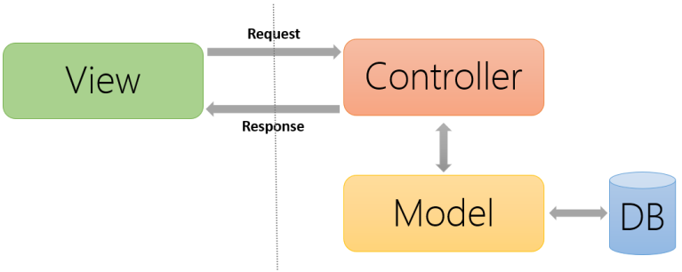
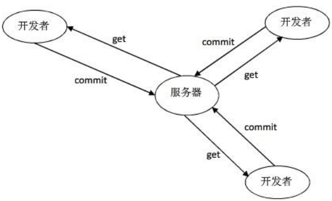
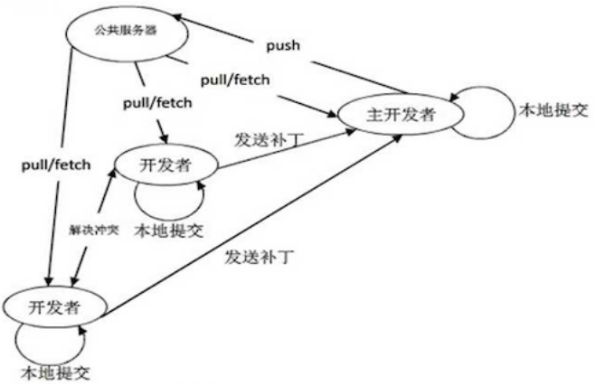

## 一、MVC网站框架



MVC模式（Model-View-Contraller）是软件工程中的一种软件架构模式，把软件系统分为三个部分：

* **模型**（Model），它是程序需要操作的数据或信息。
* **视图**（View)，它提供给用户的操作界面，是程序的外壳。
* **控制器**（Contraller）,它负责用户“视图层”输入的指令，选取“数据层”中的数据，然后对其进行相应的操作，产生最终的结果。

**特点：**构件简单，层次清晰，代码可复用性好，模块之间耦合度低。

对应到服务器程序，简单来说，就是一部分模块只负责前端页面展示，另外一部分模块只负责数据模型的定义和数据的操作，其他模块负责连接这两部分，并进行必要的逻辑处理。

对应到作业：

```tex
project/
   |-- models.py
   |-- views.py
   |-- main.py
   |
   |-- statics
   |      |-- img/
   |      |-- css/
   |	  |-- js/
   |     
   |-- templates/
   		  |-- all.html
   		  |-- base.html
   		  |-- home.html
   		  |-- info.html
   		  |-- modify.html
```

## 二、虚拟环境

> 实际工作中，可能同时要维护若干项目，每个项目使用的软件包、版本可能都不一样，比如项目A使用tornado4.3，而项目B使用tornado6.0版本同时安装到全局的Python环境下就会冲突。
>
> 所以我们要为不同的项目单独设置它所需的环境，这就需要借助虚拟环境管理。

1. 安装

   ```bash
   pip install virtualenv
   ```

2. 创建虚拟环境

   ```bash
   cd 项目文件夹 # 当项目完成后，可以退出当前虚拟环境
   
   # 虚拟文件夹一般和项目文件夹存放在一起
   virtualenv env # 虚拟文件名
   ```

3. 加载虚拟环境

   ```bash
   source env/bin/activate # 在当前项目文件夹下，激活虚拟环境
   ```

4. 退出虚拟环境

   ```bash
   deactivate # 开发完成后，退出虚拟环境
   ```
   
5. 导出虚拟环境的软件包

   ```shell
   pip freeze >requirtments.txt
   ```

6. 其他人重新搭建环境时，执行

   ```shell
   pip install -r requirements.txt
   ```

   

## 三、版本控制工具

### 版本控制工具的作用

1. 能够追踪全部代码的状态
2. 能够进行版本之间的差异对比
3. 能够进行版本回滚
4. 能够协助多个开发者进行代码合并

### 常见的版本控制工具

* CSV：基本退出历史舞台
* SVN：中心化的版本控制工具，需要有一台中心服务器



* Git：分布式的版本控制工具，中心服务器不再是必需的



* hg：纯Python开发的版本控制工具
* GitHub：依托Git而创建的一个平台，有独立的公司在运作。

**备注**：所有的文本类的东西都可以交由版本控制工具来管理。


### 1、起步

#### 1.配置

```bash
git config --global user.name 'xcw-user'
git config --global user.email 'xcw_user@qq.com'
```

#### 2.设置忽略文件

对于不需要让Git追踪的文件可以在项目目录下创建`.gitignore`文件。

```bash
touch .gitignore
```

`.gitignore`文件中写需要忽略的文件名，或是某一类文件的通配符，如下：

```bash
*.pyc
*.log
*.sqlite3
.DS_Store
.venv/
.idea/
__pycache__/
```

3.`git init` ：对仓库进行初始化，产生一个 `.git`的隐藏目录，这个文件夹就是本地仓库。

4.`git add ./`：将当前文件夹下的所有文件添加到`暂存区`。

5.`git reset __pycache__ `：将  `暂存区`  中的文件取消暂存状态。

6.`git commit -m '说明'` ：将 `暂存区` 中的代码提交到本地代码。

7.从命令行推送本地仓库到服务器

* `git remote add origin git@githubgithub.com/xcw-user/day3.git`：建立远程仓库连接；

* `git push -u origin master`： 第一次push的话，要加上 -u 在语句里，把本地master分支和远程库的master分支关联起来。
* `git push`：第二次推送；

8.实现免密登录

* `ssh-keygen`    在`~/.ssh`目录下生成一对公钥和秘钥。

* 将公钥内容`cat id_rsa.pub`复制到GitHub的设置SSH and GPG keys。

9.第一次操作，将整个远程仓库拉取到本地：

`git clone git@github.com:xcw-user/day3.git`

10.`git pull` ：将远程仓库的部分更新拉取到本地。

11.**文件还原**

* `git checkout 版本ID` 回滚到历史版本`git log 查看`

* `git checkout master`  回滚到最新版本

* `git checkout 文件名` 还原文件(尚未add提交且未添加到暂存区,红色字体)

* `git reset` + `git checkout 文件名` 还原处于暂存区的文件

12.**解决冲突**

* `git push` 发现与别人修改的代码有冲突；
* `git pull` 将线上代码拉取到本地；
* `git status` 找到冲突文件都有哪些，冲突文件状态：**both modifyied**
* 逐一打开冲突文件，逐行解决冲突；
* 冲突代码解决后，将代码中冲突的标记删除；

```python
# 冲突标记
>>>>>>HEAD
print('hello world')
======
print('hello python')
<<<<<< 版本ID
```

* `git add ./`
* `git commit -m '解决冲突，进行了一次合并'`
* `git push ` 最后重新推送。

13.**分支**

* `git branch 分支名`：创建新分支   
  * `git checkout 分支名`：切换到新创建的分支
    * 等价于`git checkout -b 分支名`：切换到新创建的分支(不存在则创建)
* `git push --set-upstream origin 分支名`：指定推送的分支的上流主支，等价于`git push -u origin 分支名`；
*  `git checkout -`：切换到上一分支(master)
* `git merge 分支名` ：合并分支到master

### 2、Git命令

| Command  | Description                      | 与远程通信 | 实例                                         |
| -------- | -------------------------------- | :--------: | -------------------------------------------- |
| init     | 在本地初始化一个新的仓库         |     /      | `git init`                                   |
| add      | 添加到暂存区                     |     /      | `git add  aaa bbb ccc/`                      |
| commit   | 将暂存区的修改提交到本地仓库     |     /      | `git commit -m '注释'`                       |
| push     | 将本地仓库的内容推送到远程仓库   |     有     | `git push`                                   |
| pull     | 将远程仓库的更新拉取到本地仓库   |     有     | `git pull`                                   |
| clone    | 将远程仓库克隆到本地             |     有     | `git clone git@github.com:xcw-user/day3.git` |
| branch   | 管理分支(-d删除)                 |     /      | `git branch`                                 |
| checkout | 切换分支/代码回滚/代码还原       |     /      | `git checkout 分支名 / 版本ID`               |
| diff     | 不同版本之间进行差异对比         |     /      | `git diff 版本1 版本2`                       |
| merge    | 合并两个分支                     |     /      | `git merge 其他分支名`                       |
| status   | 查看当前分支的状态               |     /      | `git status`                                 |
| log      | 查看提交历史(--graph)            |     /      | `git log`                                    |
| reset    | 代码重置                         |     /      | `git reset`                                  |
| blame    | 检查每一行代码最后一次是谁修改的 |     /      | `git blame 文件名`                           |


```shell
pip
	python的安装目录/lib/python3.6/site-packags
apt
	1.下载的软件存放位置
     /var/cache/apt/archives
	2.安装后软件默认位置
     /usr/share
	3.可执行文件位置 
     /usr/bin
	4.配置文件位置
     /etc
	5.lib文件位置
     /usr/lib
所有文件: `.` === `./`
```

