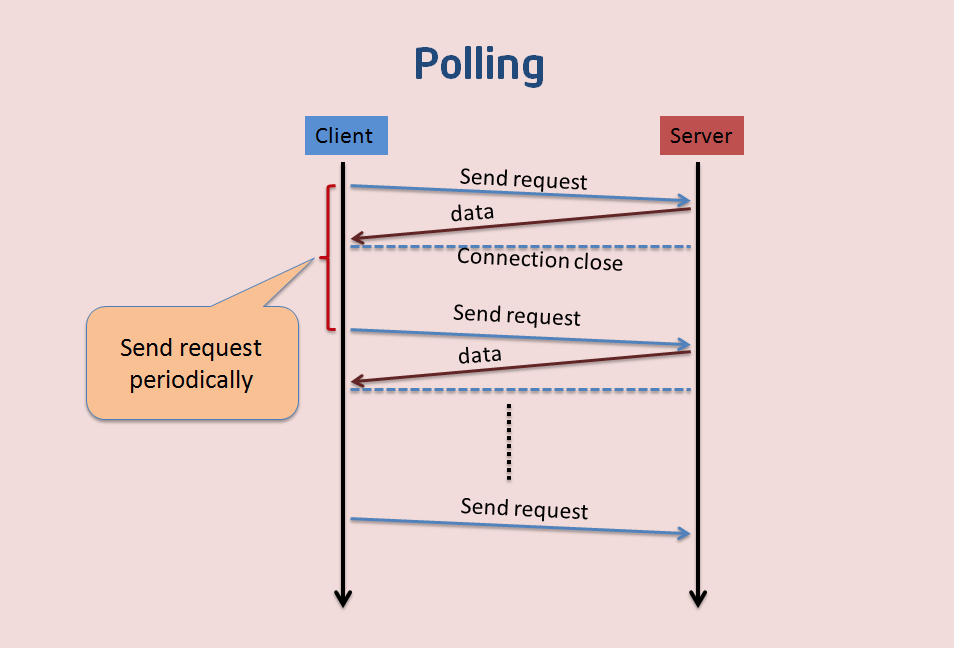
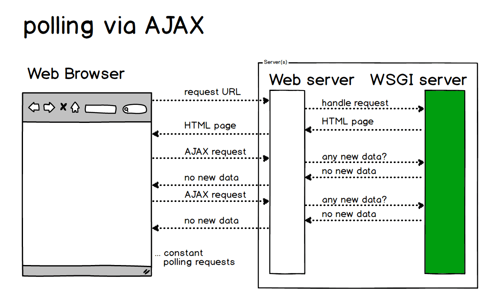
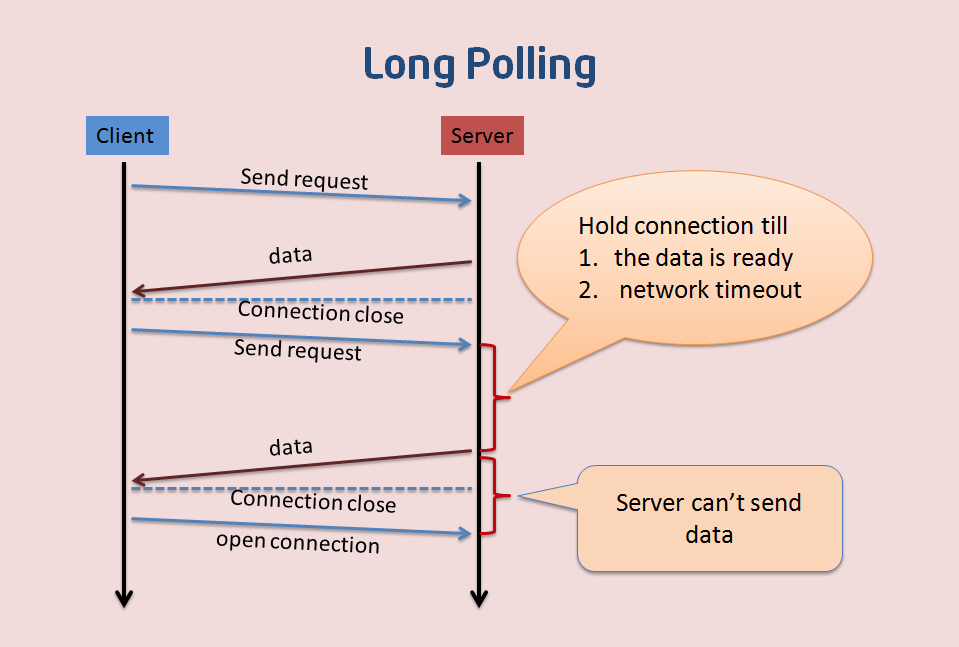
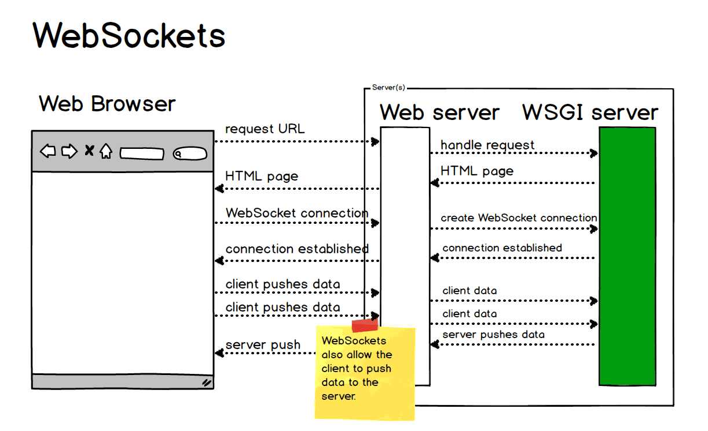

全双工/半双工

A <--------------------->B

A<============>B

```python
def speak(self):
    print('我是%s,')
def run(self):
    print()
attr={}
Dog=type('Dog',(object,),attr)
dog = Dog
```

## 一、WebSocket介绍

websocket是一种网络通信协议。在2009年诞生，于2011年被IETF定为标为标准RFC 6455通信标准。websocket API也被W3C定为标准。

WebSocket是HTML5开始提供的一种在单个TCP连接上进行全双工（full-duplex）通讯的协议。，没有了Request和Response的概念，两者地位完全平等，连接一旦建立，就建立了持久性连接，浏览器和服务器双方可以随时向对方发送数据。

HTML5 是 HTML 最新版本，包含一些新的标签和全新的 API。HTTP 是一种协议，目前最新版本是 HTTP/2 ，所以 WebSocket 和 HTTP 有一些交集，两者相异的地方还是很多。两者交集的地方在 HTTP 握手阶段，握手成功后，数据就直接从 TCP 通道传输。

### Web上的即时通信

在没有websocket之前，服务器很难主动向客户端推送数据。

Web为了实现即时通信，经历了最初的polling，到之后的Long polling，等若干种方式。

1. **短轮询 Polling**

   

   这种方式下，是不适合获取实时信息的，客户端和服务器之间会一直进行连接，每隔一段时间就询问一次。客户端会轮询，有没有新消息。这种方式连接数会很多，一个接受，一个发送。而且每次发送请求都会有 HTTP 的 Header，会很耗流量，也会消耗 CPU 的利用率。

   在Web端，短轮询用AJAX   JSON  Polling轮询实现。

   

   * **优点：**短连接，服务器处理简单，支持跨域、浏览器兼容性较好。
   * **缺点：**有一定延迟、服务器压力较大，浪费带宽流量、大部分是无效请求。

2. **长轮询Long Polling**

   

   长轮询是对轮询的改进版，客户端发送HTTP给服务器之后；服务器有没有新消息，如果没有新消息，客户端就一直等待。直到有消息或者超时了(大约60s,可以自己设置)，才会返回给客户端。消息返回后，客户端再次建立连接，如此反复。这种做法在某种程度上减小了网络带宽和CPU利用率等问题。

   这种方式也有一定的弊端，实时性不高。如果是高实时的系统，肯定不会采用这种办法。因为一个 GET 请求来回需要 2个 RTT，很可能在这段时间内，数据变化很大，客户端拿到的数据已经延后很多了。

   - **优点：**减少轮询次数，低延迟，浏览器兼容性较好。
   - **缺点：**服务器需要保持大量连接。

3. **WebSocket**

   

   为了解决其他机制的各种问题，人们设计出了WebSocket协议。

   WebSocket是HTML5开始提供的一种在单个TCP连接上进行全双工通讯的有状态协议(它不同于无状态的HTTP)，并且还能支持二进制帧、扩展协议、部分自定义协议的子协议、压缩等特性。


### 与普通HTTP协议的异同

1. WebSocket协议的URL是ws://或者wss://开头的，而不是HTTP://或者HTTPS://

2. WebSocket使用与普通HTTP或者HTTPS协议相同的80端口和443端口进行连接

3. WebSocket的Header中有两个特殊字段，代表它是由HTTP协议升级为WebSocket协议

   ```tex
   Connection: Upgrade
   Upgrade: websocket
   ```

### 通过JS建议一个简单的WebSocket连接

```js
var ws = new WebSocket('ws://127.0.0.1/msg')
ws.onopen = function(){
    ws.send('Connection established. Hello server!')
}
ws.onmessage = function(event){
    console.log('client recv:',event.data)
};
ws.onclose = function(){ ... }
ws.onerror = function(){ ... }
```

### Tornado中使用WebSocket

```python
class WebsockHandler(tornado.websocket.WebSocketHandler):
    def open(self):
        '''处理建立连接时执行的操作'''
        pass
    
    def on_close(self):
        '''处理断开连接时执行的操作'''
        pass
    
    def on_message(self,message):
        '''处理接收到消息时进行的操作'''
        pass
    
    def write_message(self,message):
        '''该方法可以给其他人发送消息'''
        pass
```

二、任务目标

1. 通过Tornado开发一个聊天室程序
2. 通过WebSocket进行长连接通信
3. 使用Redis保留100条离线消息
