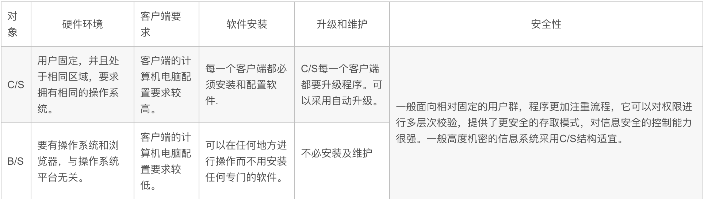
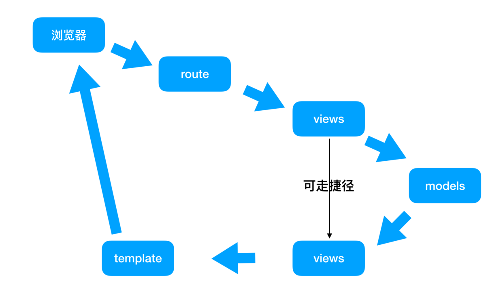

```tex
wget http://download.redis.io/releases/redis-5.0.5.tar.gz
tar -xzf redis-5.0.5.tar
cd redis-5.0.5
make编译 && make install安装
----------------------------------------------
apt 安装软件包
    apt update 更新源中的软件包
    apt install ruan  安装指定的软件xxx
    apt remove xxx 卸载软件（仅仅卸载软件）
    apt autoremove xxx 卸载软件（会卸载软件和没有用的依赖包）
    记得前面添加sudo
    注意：如果没有apt 那么解决办法 sudo apt update 更新源中的软件包管理工具
-----------------------------------------------
pip python专用的包管理工具
    pip install xxx 安装某一个软件
    pip uninstall xxx 卸载某一个软件
    pip list 列出所有的依赖包
    pip freeze 列出自己安装的所有的依赖包
```

## 一、框架简介

1. 基于Python的web框架

   * 重量级框架  `django`：
     	
     * 为了方便业务程序的开发，提供了丰富的工具及其组件。
   * 轻量级框架  `flask`：
     	
     * 只提供web核心功能，自由灵活，高度定制，Flask也被称为`microframework`，因为它使用简单的核心，用 extension 增加其他功能。

2. 官方文档

   ```tex
   http://flask.pocoo.org/docs/0.12/      英文版
   http://docs.jinkan.org/docs/flask/     中文版
   ```

3. flask依赖库

   ```tex
   以前依赖三个库：
   	jinjia2      模板引擎
   	Werkzeug     WSGI 工具集
   	Itsdangerous 基于Django的签名模块
   现在：
       Click
       Flask
       itsdangerous
       Jinja2
       MarkupSafe
       Werkzeug
   ```

4. flask流行的主要原因

   ```tex
   1 有非常齐全的官方文档，上手非常方便;
   2 有非常好的扩展机制和第三方扩展环境，工作中常见的软件都会有对应的扩展，动手实现扩展也很容易;
   3 社区活跃度非常高    flask的热度已经超过django好几百了
   4 微型框架的形式给了开发者更大的选择空间;
   ```

## 二、BS/CS架构

* 概念

  ```tex
  BS==>Browser浏览器 Server服务器  主流
  CS==>Client客户端  Server服务器
  ----------------------------------
  B/S架构是web兴起后的一种网络结构模式，web浏览器是客户端最主要的应用软件。这种模式统一了客户端，将系统功能实现的核心部分集中到了客户端，简化了系统的开发、维护和使用。
  ```

* **CS/BS的区别**

  

## 三、MVC/MTV软件架构

### MVC

* 简介：
  * MVC开始是存在与桌面程序中的，M是指业务模型model，V是指用户界面View，C则是控制器 controler,**使用MVC的目的是将M和V实现代码分离，从而使同一个程序可以使用不同的表现形式。**
  * 比如统计一批数据可以分别使用柱状图、饼状图来表示。**C 存在的目的则是确保M和V的同步，一旦M改变，V应该同步更新。**
* 实现了模型层的复用
  * 核心思想：
    * 解耦合
  * 面向对象语言：高内聚  低耦合
  * Model:
    * 模型
    * 封装数据的交互操作
    * CURD
  * View:
    * 视图
    * 是用来将数据呈现给用户的
  * Controller
    * 控制器
    * 接收用户的输入
    * 用来协调Model和View的关系，并对数据进行操作，筛选
  * 流程：
    * 控制器接收用户请求
    * 调用模型，获取输入
    * 控制器将数据展示到视图中


### MTV

也叫做MVT，本质上就是MVC的变种；

* Model
  * 同 MVC 中 Model-模型
* Template
  * 模板
  * 只是一个html,充当的是MVC中View的角色，用来做数据展示
* Views
  * 视图函数
  * 相当于MVC中Controller-控制器

## 四、Flask基本使用

### 1.虚拟环境的创建

```python
安装 ：sudo apt install virtualenv
1.创建flask的虚拟环境
	virtualenv flask1905
2.查看虚拟环境安装的库
	pip freeze 列出自己安装的依赖包(第三方库)
    pip list 列出所有的依赖包
3.加载虚拟环境
	cd 虚拟环境文件夹
    source flask/env/activate
4.虚拟环境迁移
	pip freeze > requirements.txt   迁出
    pip install -r requirements.txt 迁入
5.退出虚拟环境
	deactivate
```

### 2.Flask项目的创建

* 终端
* Pycharm专业版
* Pycharm社区版

```python
1.安装
	pip install flask
2.创建项目
	在一个文件夹下面创建一个文件 app.py
	(mkdir day01 ;vim app.py)
	书写代码：
	from flask import Flask
	
	app = Flask(__name__)
	@app.route('/')
	def index():
		'''视图函数'''
        return 'Hello World!'
    if __name__ == '__main__'
    	app.run()
3.启动服务器：python app.py
	默认端口号：5000 只允许本机连接
4.在浏览器的URL地址栏输入：127.0.0.1:5000
```

### 3.启动服务器参数修改

```tex
app.run()方法中添加参数:
1.debug=True
	是否开启调试模式，开启后修改过Python代码自动重启，如果修改的是html/js/css那么不会自动重启。
2.host=0.0.0.0
	主机，默认是127.0.0.1 指定为0.0.0.0代表本机IP,必须是字符串
3.port=9999
	指定服务器端口号，可以是整数或者字符串
4.threaded
	是否开启多线程
```

### 扩展：PIN码

```tex
全称Personal Identification Number.就是SIM卡的个人识别密码。手机的PIN码是保护SIM卡的一种安全措施，防止别人盗用SIM卡，如果启用了开机PIN码，那么每次开机后就要输入4到8位数PIN码。
在输入三次PIN码错误时，手机便会自动锁卡，并提示输入PUK码解锁，需要使用服务密码拨打运营商客服热线，客服会告知初始的PUK码，输入PUK码之后就会解锁PIN码。
```

### 4.命令行参数

1. 安装

   ```tex
   pip install flask-script
   作用：启动命令行参数
   ```

2. 初始化

   ```tex
   修改 app.py为manager.py
   添加 manager = Manager(app=app)
   修改 app.run()为manager.run()
   ```

3. 运行

   ```python
   python manager.py runserver -h 0.0.0.0 -p 9999 -d -r
   ```

   * 参数：
     * `-p`   端口   port
     * `-h`   主机   host
     * `-d`   调试模式   debug  出现  PIN 码
     * `-r`   重启(重新加载)    reload（restart）

## 五、视图函数返回值

**视图函数的返回值必须是字符串、字典、 元组、response对象，不可以是整数。**

1. index返回字符串

   ```python
   @app.route('/index/')
   def index():
       return 'index'
   ```

2. 模板testreturn.html

   ```python
   @app.route('/testreturn/')
   def index():
       return render_template('testreturn.html')
   ```

   * 静态文件css:
     * 注意：`<link rel="stylesheet" href="/static/hello.css">`

### manager.py

```python
from flask import Flask, render_template
from flask_script import Manager

# 创建flask的应用对象
# __name__表示当前的模块名字
app = Flask(__name__)

manager = Manager(app=app)
@app.route('/')
def hello():
    print('天上人间')
    return 'Hello world!'
# 如果路由的格式是‘/index/’那么请求资源路径是"127.0.0.1:5000/index"或者是"127.0.0.1/index/", 不加/会自动补全
@app.route('/index/')
def index():
    return 'index'
#如果路由的格式是'/index1'那么请求资源路径必须是"127.0.0.1:5000/index1"（不加/）,加上/会报错404
@app.route('/index1')
def index1():
    return 'index1'
# 视图函数的返回值必须是字符串 字典 元组 response对象
@app.route('/testreturn/')
def testreturn():
    # 视图函数的返回值类型不可以是整数
    # return 1
    return '1'
# 执行视图函数跳转到一个页面
@app.route('/testreturn1/')
def testreturn1():
    # render_template 方法返回值是字符串
    s=render_template('testreturn1.html')
    print(type(s))
    return s

if __name__ == '__main__':
    # 如果想修改主机和端口号，那么可以在run方法中指定对应的参数
    # pymysql的port必须是整数
    # app.run(port='9999',host='0.0.0.0',debug=True)
    manager.run()
```

## 六、FLask基础结构

```tex
App/
 |-- templates模板，默认也需要和项目保持一致
 |
 |-- static静态资源，默认需要和我们的项目保持一致，在一个路径中，指的Flask对象创建的路径
 |-- views
 |-- models
 |-- manager.py
```

```tex
1 封装的步骤
    （1）命令行参数
    （2）文件的封装App.package包
    （3）蓝图
```

注意：

* 执行过程中`manager.py`和其他的文件的路径问题
* 封装`__init__.py`文件

## 七、蓝图

1. 宏伟蓝图

2. 蓝图也是一种规划，主要用来规划`urls路由`

3. 蓝图的基本使用

   * 安装

     ```python
     pip install flask-blueprint
     ```
   
   * 初始化蓝图对象（**在views.py文件里书写**）
     
     ```python
     from flask import Blueprint
     blue = Blueprint('first',__name__)
     ```
   
   * 调用蓝图进行路由注册(**在manager.py文件里书写**)
   
     ```python
     app.register_blueprint(blueprint=blue)
     ```

**实现蓝图：**


```python
# app.py
from flask import Flask

app=Flask(__name__)

@app.route('/index/')
def index():
    return "<h1>Hello World!</h1>"

if __name__ == '__main__':
    app.run(debug=True,host='0.0.0.0',port=9999)
# python app.py
```

```python
# manager.py
from flask import Flask
from flask_script import Manager

app=Flask(__name__)
manager = Manager(app=app)

@app.route('/index/')
def index():
    return "<h1>Hello World!</h1>"

if __name__ == '__main__':
    manager.run()
# python manager.py runserver -h '0.0.0.0' -p 5200 -d -r
 * Debug mode: on
 * Running on http://0.0.0.0:5200/ (Press CTRL+C to quit)
 * Restarting with stat
 * Debugger is active!
 * Debugger PIN: 153-603-632
```

```python
# manager.py
from flask_script import Manager

from App import create_app
from App.views import blue

app=create_app()

manager = Manager(app=app)
app.register_blueprint(blueprint=blue)

if __name__ == '__main__':
    manager.run()

# App/views.py------------------
from flask import Blueprint, render_template

blue = Blueprint('first',__name__)

@blue.route('/index/')
def index():
    return "<h1>Hello World!</h1>"

# App/__init__.py---------------
from flask import Flask

def create_app():
    app = Flask(__name__)
    return app
```

## 八、Flask请求流程

```tex
1.请求到路由   app.route()
2.然后到视图函数   
3.视图函数和models交互
4.模型返回数据到视图函数
5.视图函数渲染模板
6.模板返回给用户
```



## 九、Flask路由参数

```tex
2 参数
    路由参数
        http://www.baidu.com/s/1/
    请求资源路径参数
        https://www.baidu.com/s?wd=韩红
```

1.带参数的请求

* 从客户端或者浏览器发过来的请求带参数

  ```python
  @blue.route('/getstudents/<id>/')
  def getstudents():
      return '学生%s'+id
  ```

2.路由参数

* 基础结构    `/资源路径/<变量>`

    ```tex
    访问路径 http://127.0.0.1/testRoute/1/
    路由参数的名字一定要和视图函数的参数一致
    路由参数传到视图函数 是字符串类型
    ```

* 六大类型

  * string

    ```python
    接收的时候也是str,匹配到/的时候结束
    @blue.route('/testRoute1/<string:name>/')
    def testRoute1(name):
    print(name)
    print(type(name))
    return 'testRoute1'
    ```
    
  * path

    ```python
    接收的时候也是str， / 只会当作字符串中的一个字符处理
    @blue.route('/testRoute2/<path:name>/')
    def testRoute2(name):
    print(name)
    print(type(name))
    return 'testRoute2'
    zhangsan/lisi
    <class 'str'>
    ```
  
  * 总结：string和path的区别
  
  ```
  string 遇到 / 会当做结束标志
  path   遇到 / 会当做一个字符串
  ```
  
  * int
  
    ```python
    @blue.route('/testRoute3/<int:money>')
    def testRoute(money):
    print(money)
  print(type(money))
    return 'testRoute3'
    999
    <class 'int'>
    ```
  
  * float
    
    ```python
    @blue.route('/testRoute4/<float:price>')
    def testRoute(price):
        print(price)
        print(type(price))
        return price
    3.14
    <class 'float'>
    ```
    
  * uuid
    
    ```python
    from uuid import uuid4
    @blue.route('/testRoute5/<uuid:uid>')
    def testRoute5(uid):
        uid = uuid.uuid4()
        print(uid)
        print(type(uid))
    ea389523-b95e-4dfa-95dc-e47eb982cbb8
    <class 'uuid.UUID'>
    ```
    
  * any
    
    ```python
    @blue.route('/testRoute6/<any(a,b):p>')
    def testRoute6(p):
        print(p)
        print(type(p))
        return p
    a
    <class 'str'>
    ```


## 十、postman模拟请求工具

### 请求方式

```python
# 请求方式又叫HTTP方法
get(请求)、post(添加)、delete(删除)、  
put(修改全部属性)、patch(修改部分属性);
```

```python
# 状态码
200-成功  301-重定向  302-永久重定向  403-防跨站攻击
404-路径错误  405-请求方式错误   505-服务器(业务逻辑)错误
# 200成功条件：成功接收到数据,并且传输数据没有丢失。
```

* `postman`使用模拟请求工具

  ```python
  @blue.route('/testPostman/',methods=['Post','get'])
  def testPostman():
      return '你的梦想是不是说说而已'
  ```

* 注意：

 1. 路由默认只支持`GET，HEAD，OPTIONS`请求方式

 2. 如果想让路由支持`post、delete、put、putch`请求方式，需要手动指定

 3. 可以在route方法中方法中添加一个参数`metnods=[]`

    ```python
    methods=["GET","POST","PUT","DELETE"]
    ```

 4. methods列表的元素的大小写都可以(以前不支持)

```python
# 需求：执行一个视图函数 然后跳转到一个模板 login.html
# 在模板中输入用户名字  然后点击登录
# 点击之后 显示欢迎光临红浪漫

@blue.route('/toLogin/')
def toLogin():
    return render_template('login.html')

@blue.route('/login/',methods=['post','delete'])
def login():
    return '欢迎光临红浪漫,拖鞋手牌拿好,楼上二楼左转,男宾3位'
```

## 十一、反向解析

### 1、概念

* 获取请求资源路径

### 2、语法格式

```tex
url_for('蓝图的的名字.方法名字')
```

### 3、使用

```python
blue = blueprint('blue',__name__)

@blue.route('/testPostman/',methods=['Post','get'])
def testPostman():
    return '你的梦想是不是说说而已'
@blue.route('/testReverse/',methods=['get','post'])
def testReverse():
    return 'testReverse'
@blue.route('/testReverse1/')
def testReverse1():
    s = url_for('blue.testReverse')
    print(s)
    s1 = url_for('blue.testPostman')
    print(s1)
    return 'testReverse1'
```

### 4、应用场景

1. `redirect(url_for('blue.testReverse'))`重定向到index请求,尽量不要使用硬编码`redirect('/index/')`
2. 页面中不要写硬编码 `form action='/login/'`，`form action=url_for('blue.login')`